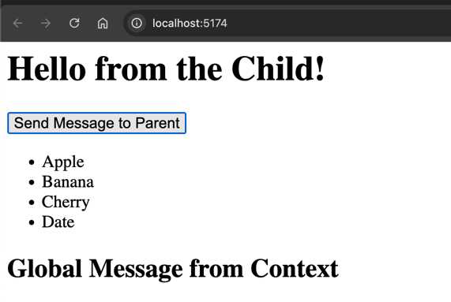

### Key Components and Functions:

1. **App.tsx**:
    - Manages the core application state with two pieces of state: `todos` (an array of todo items) and `task` (a string representing the current input value).
    - Functions are defined to modify the state, such as adding, removing, toggling completion, and clearing todos.

2. **TodoInput.tsx**:
    - Handles the input field where users can type a new task and buttons for adding a new todo or clearing all todos.
    - Receives props from `App.tsx`:
        - `task`: Current value in the input field.
        - `setTask`: A function to update the `task` state in `App.tsx`.
        - `addTodo`: A function to add a new todo to the `todos` array in `App.tsx`.
        - `clearTodos`: A function to clear all todos in `App.tsx`.

3. **TodoList.tsx**:
    - Receives the list of `todos` and renders each one using the `TodoItem` component.
    - It also passes down `toggleCompletion` and `removeTodo` functions to `TodoItem` for each todo.

4. **TodoItem.tsx**:
    - Represents a single todo item. It renders the task and provides a button to remove the todo and a clickable area to toggle its completion.
    - Receives props from `TodoList.tsx`:
        - `todo`: The individual todo object.
        - `toggleCompletion`: A function to toggle the completion state of a todo.
        - `removeTodo`: A function to remove a todo from the list.

### Flow Example:

1. **Inputting a Task**:
    - The user types a task into the `TodoInput` field.
    - The `onChange` event updates the `task` state in `App.tsx` using the `setTask` function.
    - When the user clicks the "Add" button, the `addTodo` function is triggered, adding a new todo item to the `todos` array in `App.tsx`. This includes the current value of `task`, an auto-generated `id`, and a `completed` status of `false`.

2. **Displaying Todos**:
    - The `todos` state is passed to `TodoList.tsx`, which then maps over the list of todos and renders each one using `TodoItem.tsx`.
    - The `toggleCompletion` and `removeTodo` functions are passed down to `TodoItem` for each todo.

3. **Toggle Completion**:
    - When a user clicks on a todo item (inside `TodoItem`), the `toggleCompletion` function is triggered, passing the `id` of the todo to `App.tsx`.
    - The `toggleCompletion` function in `App.tsx` uses `setTodos` to update the `completed` property of the corresponding todo, either marking it as completed or incomplete.

4. **Remove Todo**:
    - If the user clicks the "Delete" button on a todo item, the `removeTodo` function is called, which removes the todo with the given `id` from the `todos` state by filtering out that todo.

5. **Clearing Todos**:
    - When the "Clear All" button is clicked in `TodoInput`, the `clearTodos` function is triggered, which resets the `todos` state to an empty array, effectively clearing all todos.

6. **Displaying the Remaining Tasks**:
    - The expression `{todos.filter((todo) => !todo.completed).length}` counts how many todos are not completed (i.e., how many tasks are left to do).
    - This count is displayed in the `App.tsx` component inside a `div` below the todo list.

### Summary of Data Flow:

1. **State** (`todos`, `task`) is stored in the `App.tsx` component.
2. **Interaction**:
    - Users input tasks through `TodoInput`.
    - Tasks are added to `todos` in `App.tsx` through `addTodo`.
    - The `todos` list is passed down to `TodoList` and rendered as `TodoItem` components.
    - Users can toggle completion or remove tasks via actions handled by functions (`toggleCompletion`, `removeTodo`) in `App.tsx`.
3. **Dynamic Updates**: Changes to `todos` or `task` trigger re-rendering, updating the UI accordingly (e.g., displaying the task count or showing completed tasks with a strike-through).

This flow ensures that the app is interactive, responsive, and maintains state in a clear, manageable way.


!--------------------------

Let's go through the data flow with some sample data to make it clearer.

### Initial State:
At the start, the `todos` state is an empty array, and the `task` state is an empty string.

```ts
const [todos, setTodos] = useState<Todo[]>([]);  // Initial state: []
const [task, setTask] = useState<string>("");  // Initial state: ""
```

### Sample Scenario:

1. **User adds a task:**
    - The user types "Buy groceries" into the input field.
    - The `setTask` function updates the `task` state.
    - The user clicks the "Add" button.
    - The `addTodo` function is called, which adds the new todo to the `todos` array.

#### Action:
- Input field: "Buy groceries"
- `addTodo` function:
    - Checks if `task` is non-empty.
    - Adds a new todo with a unique `id` (e.g., `1671234567890`), the task "Buy groceries", and sets `completed: false`.

#### Updated State:
```ts
todos = [
  { id: 1671234567890, task: "Buy groceries", completed: false }
];
task = "";  // The input field is cleared.
```

---

2. **User adds another task:**
    - The user types "Clean the house" into the input field.
    - The `setTask` function updates the `task` state.
    - The user clicks the "Add" button.
    - The `addTodo` function adds another todo to the `todos` array.

#### Action:
- Input field: "Clean the house"
- `addTodo` function:
    - Adds a new todo with a unique `id` (e.g., `1671234567999`), the task "Clean the house", and sets `completed: false`.

#### Updated State:
```ts
todos = [
  { id: 1671234567890, task: "Buy groceries", completed: false },
  { id: 1671234567999, task: "Clean the house", completed: false }
];
task = "";  // The input field is cleared.
```

---

3. **User toggles the completion of the first todo ("Buy groceries"):**
    - The user clicks on the "Buy groceries" task, which triggers the `toggleCompletion` function.
    - The `toggleCompletion` function updates the `completed` property of the "Buy groceries" todo to `true`.

#### Action:
- `toggleCompletion` for the todo with `id: 1671234567890`.
- The `completed` state of this todo is toggled from `false` to `true`.

#### Updated State:
```ts
todos = [
  { id: 1671234567890, task: "Buy groceries", completed: true },
  { id: 1671234567999, task: "Clean the house", completed: false }
];
```

---

4. **User removes the second todo ("Clean the house"):**
    - The user clicks the "Delete" button next to the "Clean the house" task, which triggers the `removeTodo` function.
    - The `removeTodo` function removes the todo with `id: 1671234567999` from the `todos` array.

#### Action:
- `removeTodo` for the todo with `id: 1671234567999`.
- The todo is removed from the array.

#### Updated State:
```ts
todos = [
  { id: 1671234567890, task: "Buy groceries", completed: true }
];
```

---

5. **User clicks the "Clear All" button:**
    - The user clicks the "Clear All" button, which triggers the `clearTodos` function.
    - The `clearTodos` function resets the `todos` array to an empty array.

#### Action:
- `clearTodos` function is triggered, and the `todos` state is reset to an empty array.

#### Updated State:
```ts
todos = [];  // All todos are removed.
```

---

6. **Displaying the remaining tasks:**
    - The expression `{todos.filter((todo) => !todo.completed).length}` calculates the number of tasks that are not completed.
    - After all tasks are removed, the length will be `0`.

#### Example:
- If there were tasks left, this expression would show how many tasks are still to be done.
  For example, with one todo left:
  ```ts
  todos = [
    { id: 1671234567890, task: "Buy groceries", completed: false }
  ];
  ```

- The display would show:
  ```
  1 tasks left to do
  ```

- After clearing all todos, the display would show:
  ```
  0 tasks left to do
  ```

---

### Final Example Flow with Sample Data:

1. User adds "Buy groceries" → `todos = [{ id: 1671234567890, task: "Buy groceries", completed: false }]`
2. User adds "Clean the house" → `todos = [{ id: 1671234567890, task: "Buy groceries", completed: false }, { id: 1671234567999, task: "Clean the house", completed: false }]`
3. User toggles completion of "Buy groceries" → `todos = [{ id: 1671234567890, task: "Buy groceries", completed: true }, { id: 1671234567999, task: "Clean the house", completed: false }]`
4. User removes "Clean the house" → `todos = [{ id: 1671234567890, task: "Buy groceries", completed: true }]`
5. User clears all todos → `todos = []`

This demonstrates how the state changes and how each action in the app (adding, completing, removing, clearing) updates the state, which then triggers re-rendering to update the UI.


