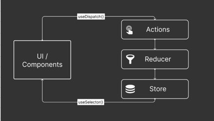

Flowchart Representation
Start
⬇️
Component Mount (useEffect)
Trigger dispatch(fetchData()).
⬇️
Dispatch fetchDataStart() Action
Sets loading = true in the Redux state.
Clears error.
⬇️
Perform API Fetch Request (fetch)
URL: https://jsonplaceholder.typicode.com/todos.
⬇️
Is the API Request Successful?
YES → Dispatch fetchDataSuccess()
Update data in the state.
Set loading = false.
⬇️
NO → Dispatch fetchDataFailure()
Update error in the state.
Set loading = false.
⬇️
Render State in UI
If loading = true → Show "Loading..."
If error exists → Show "Error: {error.message}".
If data exists → Show fetched JSON data.
⬇️
End
Diagram Tools
To visualize this in a flowchart format, you can use tools like:

Draw.io (Diagrams.net) – Drag-and-drop shapes for the flowchart.

Lucidchart – Another visual tool for flowchart creation.

Mermaid.js – For a code-based diagram:

flowchart TD
Start --> ComponentMount
ComponentMount --> DispatchFetchDataStart
DispatchFetchDataStart --> APICall
APICall -->|Success| DispatchFetchDataSuccess
APICall -->|Failure| DispatchFetchDataFailure
DispatchFetchDataSuccess --> RenderState
DispatchFetchDataFailure --> RenderState
RenderState --> End
