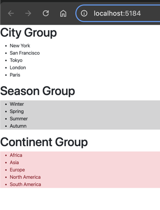

| Concept       | Explanation                                                                 |
|---------------|-----------------------------------------------------------------------------|
| `initialState`| `{ count: 0 }` - The initial state, where `count` is initialized to 0.       |
| `reducer`     | A function that takes `state` and `action` as arguments and updates the state based on the action type. |
| `state`       | The current state (e.g., `{ count: 0 }`), which holds the current value.    |
| `action`      | The object dispatched to the reducer, usually contains a `type` (e.g., `'increment'`) to define the update. |
| `switch`      | A `switch` statement inside the reducer to check the action type and return a new state accordingly. |
| `Counter()`   | The component where `useReducer` is called to manage the state. `const [state, dispatch] = useReducer(reducer, initialState);` |
| `dispatch`    | A function used to send actions (e.g., `{ type: 'increment' }`) to the reducer. |
| `dispatch({ type: 'increment' })` | Action dispatched to increment the count. |
| `dispatch({ type: 'decrement' })` | Action dispatched to decrement the count. |
| `dispatch({ type: 'reset' })`     | Action dispatched to reset the count to 0. |

