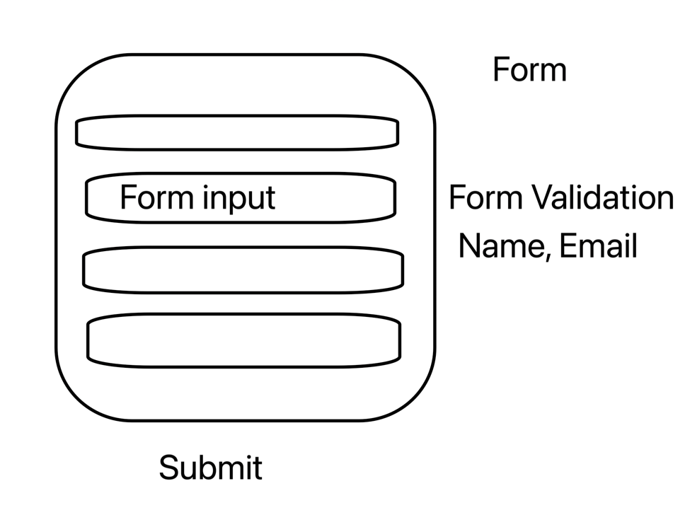

UseContext hook is similar to props but  props pass arguments only from parent component to child  component but not sub child components directly..to overcome this useContext hook us used.

! App(create context and provider) 
! -> Container -> Users -> User (user context)

---------------+