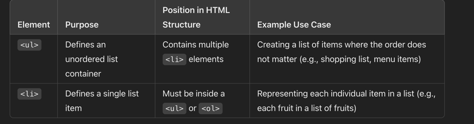

! image, name, price, add ( product list)
! image, name, price, remove (cart)

Unordered list -> list item 

<ul>
  <li>Apple</li>
  <li>Banana</li>
  <li>Orange</li>
</ul>

{
cartItem.length === 0 ? 'Cart is empty' : cartItem.map((item, index) => (
    <li key={index}>
        
        
 &{item.price} 

    </li>       
))}

---
reduce - for total and checkout total
ternary operator - for empty cart (if condition true or false)
map (item,index)
---
"First, filter the items, 
then map over them to display, 
and finally reduce the list to calculate the total count."
----