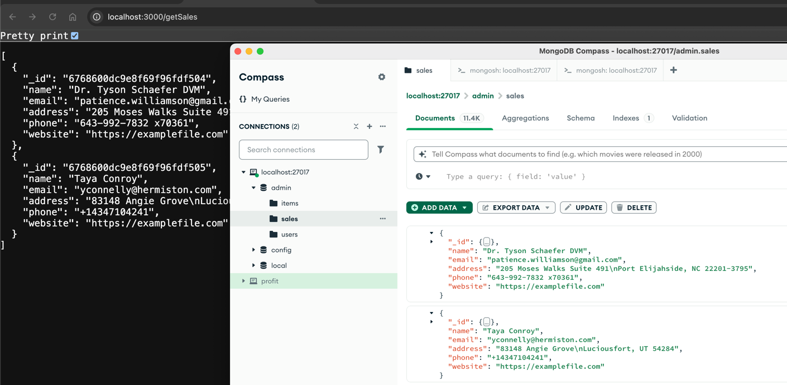

node index.js
http://localhost:3000/getSales

~ lsof -i :3000
~ kill -9 10872

----
mkdir mongoloc
cd mongoloc

npm init -y  (Install package.json)
npm install express mongosse (API libraries for mongodb)
index.js
---
Delete all rows except the first two rows in mongo db shell 

db.sales.find().sort({_id: 1}).skip(2).forEach(function(doc) {
db.sales.deleteOne({_id: doc._id});
});

---

