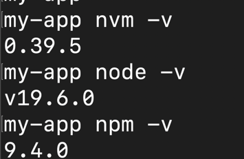
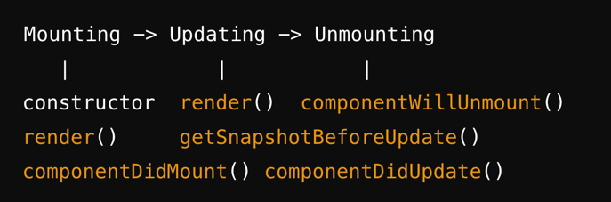
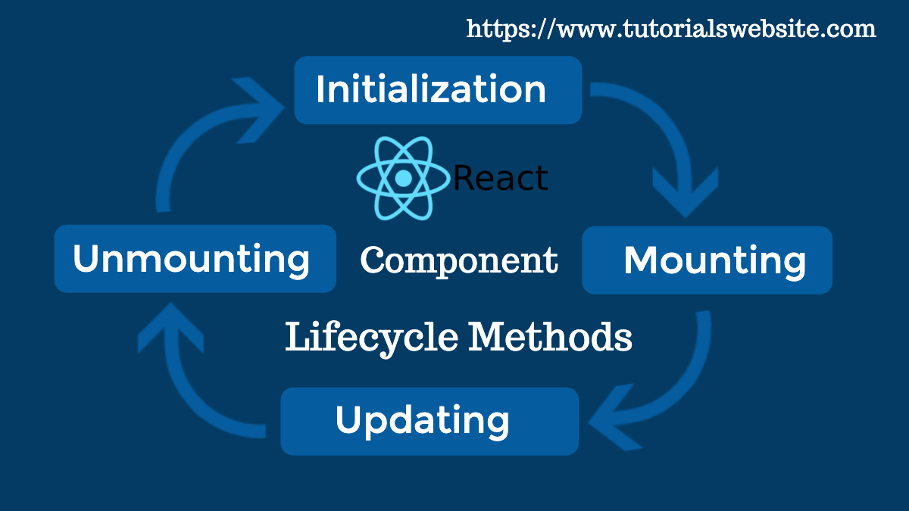
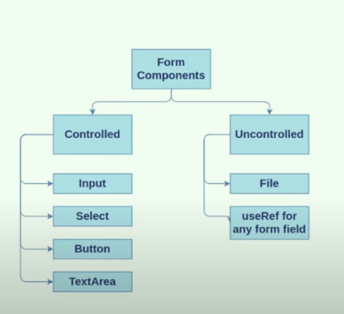
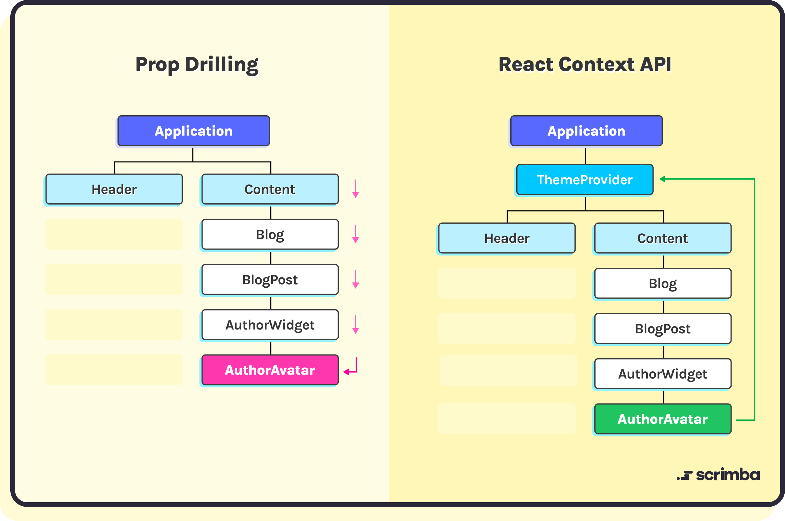
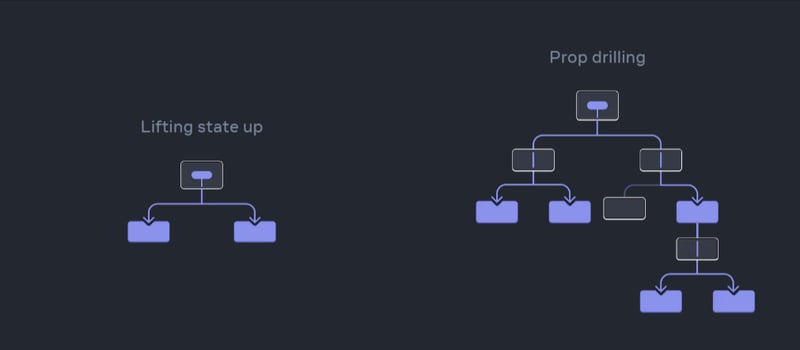
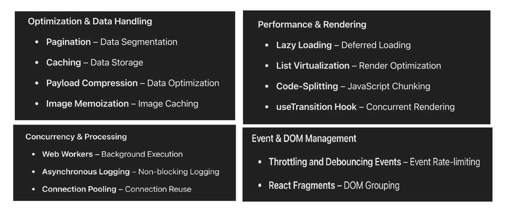
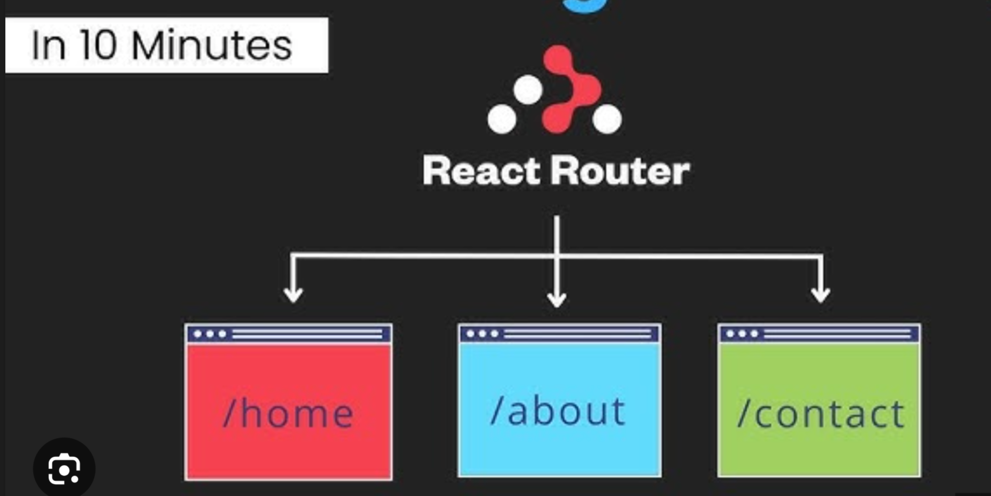

Here’s a list of commonly asked React.js interview questions categorized by difficulty level:

### **Beginner Level**
1. **What is React.js?**
<b>
  React.js is a popular open-source JavaScript library  
 It is used for building user interfaces (UIs).  
 It is especially used for single-page applications (SPAs).  
 React.js was developed by Facebook (now Meta).  
 It is maintained by Meta and a community of developers.  
</b>
6. **Explain the key features of React.**
  <b> 
      Component-Based Architecture: 
       JSX (JavaScript XML): 
      Virtual DOM: 
      Unidirectional Data Flow: 
      State and Props: 
      React Hooks: 
      Component Lifecycle: 
      React Router: 
      Declarative Syntax: 
       Context API: 
     Performance Optimization: 
     Ecosystem and Libraries: 
   </b>
7. **What are components in React?**
8. 
8. **What is the difference between functional and class components?**

9. **Explain JSX. Why is it used?**
10. 
10. **What is the Virtual DOM, and how does it work?**
11. **How do you create a component in React?**

**Functional Component: Use a simple JavaScript function that returns JSX.**
**Class Component: Use a class that extends React.Component and implements the render() method.**
**Props: Pass data to components via props to make them dynamic.
**State: Manage internal state within a component using useState (for functional components).**

12. **What is state in React? How is it different from props?**

Aspect	Props	State
Purpose	Used to pass data from parent to child components.	
Used to manage internal data and control component behavior.

13. **Explain the concept of props in React.**
14. **What is the significance of keys in React lists?**

---

### **Intermediate Level**
1. **How does React handle events differently from regular HTML?**

2. **What is the use of `useState` and `useEffect` hooks?**

3. **Explain the lifecycle methods of class components.** (2nd Jan 2025)

# Mounting -> Updating -> Unmounting

# |            |           |
# constructor  render()  componentWillUnmount()
# render()     getSnapshotBeforeUpdate()
# componentDidMount() componentDidUpdate()

 4. **What are controlled and uncontrolled components in React?**

5. **What is prop drilling, and how can it be avoided?**

-

6. **How does React Router work?**

# React Router enables navigation between components based on URL paths.

7. **Explain how conditional rendering works in React.**
   if, ternary operators, or logical operators
   {isLoggedIn ? <h1>Welcome Back!</h1> : <h1>Please Log In</h1>}

   if (isLoggedIn) {
   return <h1>Welcome Back!</h1>;
   } else {
   return <h1>Please Log In</h1>;
   }

8. **What is context in React, and how is it used?**
   Context in React allows sharing values across components 
   without prop drilling, using createContext(), Provider, and useContext.

9. **What is the significance of React Fragments?**
React Fragments allow grouping multiple elements 
without adding extra nodes to the DOM, 
improving performance and cleaner markup.
<>
     <h1></h1>
     

</>

10. **How do you handle forms in React?**

In React, forms are handled by using controlled components, 
where form data is managed by React state and updated via 
event handlers like onChange and onSubmit.
---

### **Advanced Level**
1. **What are React portals?**

React Portals enable rendering components outside the parent component's 
DOM hierarchy while maintaining React's component tree behavior.

2. **Explain Higher-Order Components (HOCs).**
   Higher-Order Components (HOCs) are functions 
  that take a component and return a new component with 
  additional functionality or enhanced behavior.

3. **What are render props in React?**
4. 
4. **How does React optimize performance with memoization (`React.memo`)?**

React optimizes performance with memoization by using React.
memo to prevent unnecessary re-renders of components when their props haven't changed.

5. **What is reconciliation in React?**

#    Reconciliation in React is the process by which 
#   React updates the DOM to reflect changes in the component state or props.

6. **What are custom hooks, and why would you create one?**

Custom hooks in React are user-defined functions that allow you to encapsulate 
and reuse logic related to state, effects, and other React features across 
multiple components.

7. **Explain the concept of lazy loading in React.**
   Lazy loading in React is a technique where components or resources 
are loaded only when they are needed, rather than loading everything upfront.

8. **How do you manage global state in a React application?**
   For small-to-medium apps: 
Using React Context or useState is often sufficient for managing global state.
   For larger applications: 
Tools like Redux, Recoil, or Zustand provide more robust and scalable solutions.

- Context, useState, Redux, Recoil, Zustand
  Context: Prop-drilling solution.
  useState: Local state hook.
  Redux: Centralized state management.
  Recoil: Atoms-based state management.
  Zustand: Minimalistic state management.

9. **What are the differences between `useMemo` and `useCallback` hooks?**
   useMemo is for memoizing values (e.g., the result of a computation),
    while useCallback is for memoizing functions (e.g., event handlers).

10. **How would you handle error boundaries in React?**

In React, error boundaries are class components that catch 
and handle errors in the component tree, allowing you to display 
fallback UI without crashing the entire app.
---

### **Coding Questions/Practical**
1. **Build a simple counter app using React hooks.**
2. **Create a to-do list with the ability to add and delete items.**
3. **Implement a modal component using React.**
4. **Build a form with validation in React.**
5. **Create a custom hook for data fetching.**

Would you like a deep dive into any specific question or code example?

-----------

Life cycle management in reactjs

Router:
Define the path and render the path 

